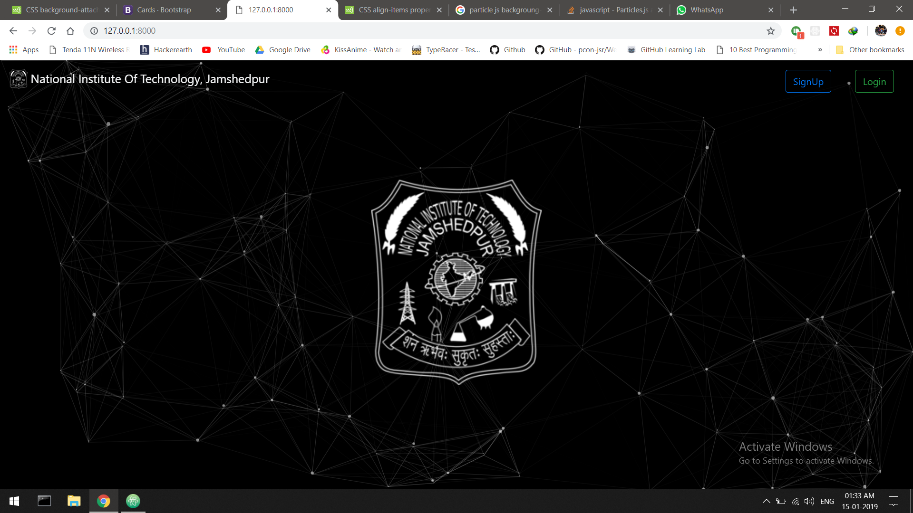
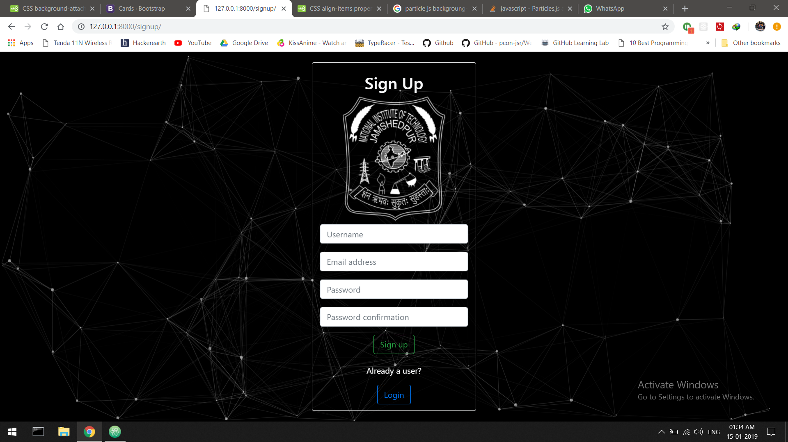
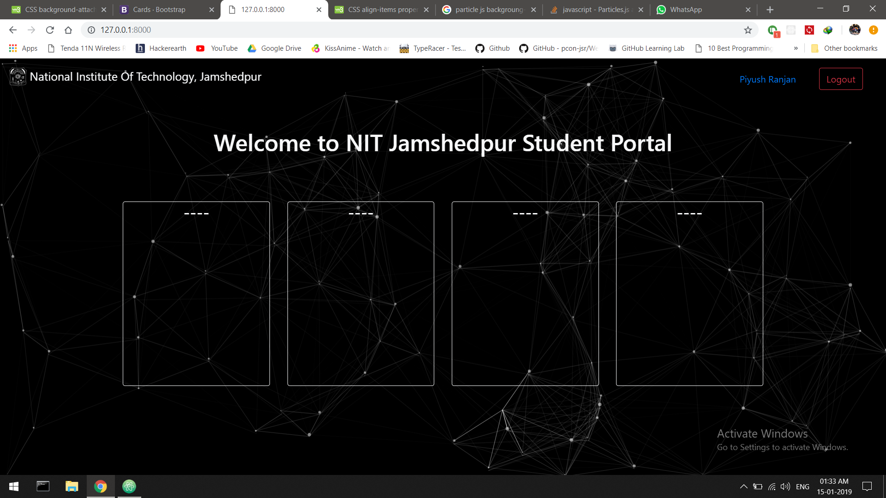

# Student Portal for Computer Science and Engineering Department of NIT Jamshedpur 
<br/> Web application based on Django.
<br/>This website is in the intial stage of developement.

To run this web application we need to install django on a virtual environment. 
First we need to download and install Anaconda 3. <br/> For [Windows](https://www.anaconda.com/download/#windows) <br/> For [Linux](https://www.anaconda.com/download/#linux)
 
 After installation we need to create a virtual environment. To do this we need to run the following commands:
```
conda create --name djangoenv python=3
``` 
 Now we need to install django on this virtual environment:
```
activate djangoenv
pip install django
 ```
 Now clone the repository by running the following code:
 ```
 git clone https://github.com/piyush072/StudentPortal.git
 ``` 
 Now open terminal and navigate inside the cloned folder.
 ```
 cd StudentPortal
 ```
 Now run the following commands to create a new user:
 ```
 python manage.py createsuperuser
 ```
 You will be asked your username, email id and password.
 <br/>Now that your user id is created you can now run your server locally by just running the following command:
 ```
 python manage.py runserver
 ```
 Now open your browser and enter the following address
 >127.0.0.1:8000
 
 You will see the following page:
 <br/>
 <br/>
 
 <br/>
 <br/>
 Now click on the login button and log in with the user id created.
 <br/>
 <br/>
 
 <br/>
 <br/>
 You can also create a new user using the Sign Up page:
 <br/>
 <br/>
 
 <br/>
 <br/>
 After signing in your page will look something like this:
 <br/>
 <br/>
 
 <br/>
 <br/>
 I will be completing this web application soon!
 
